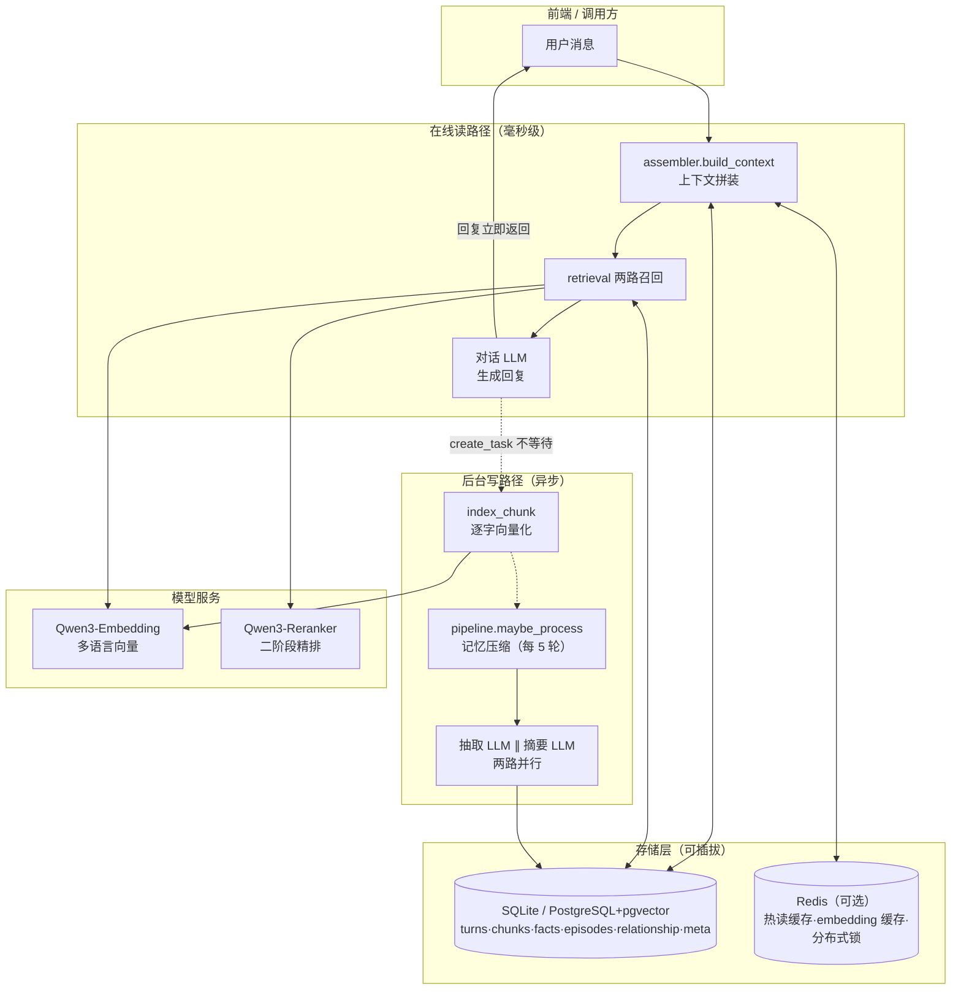
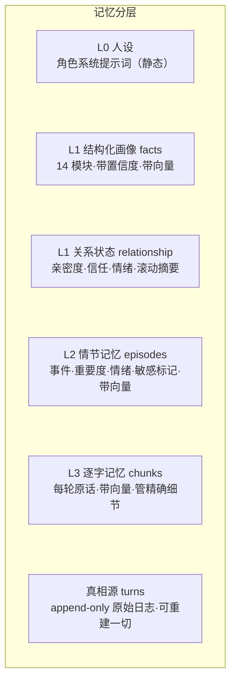
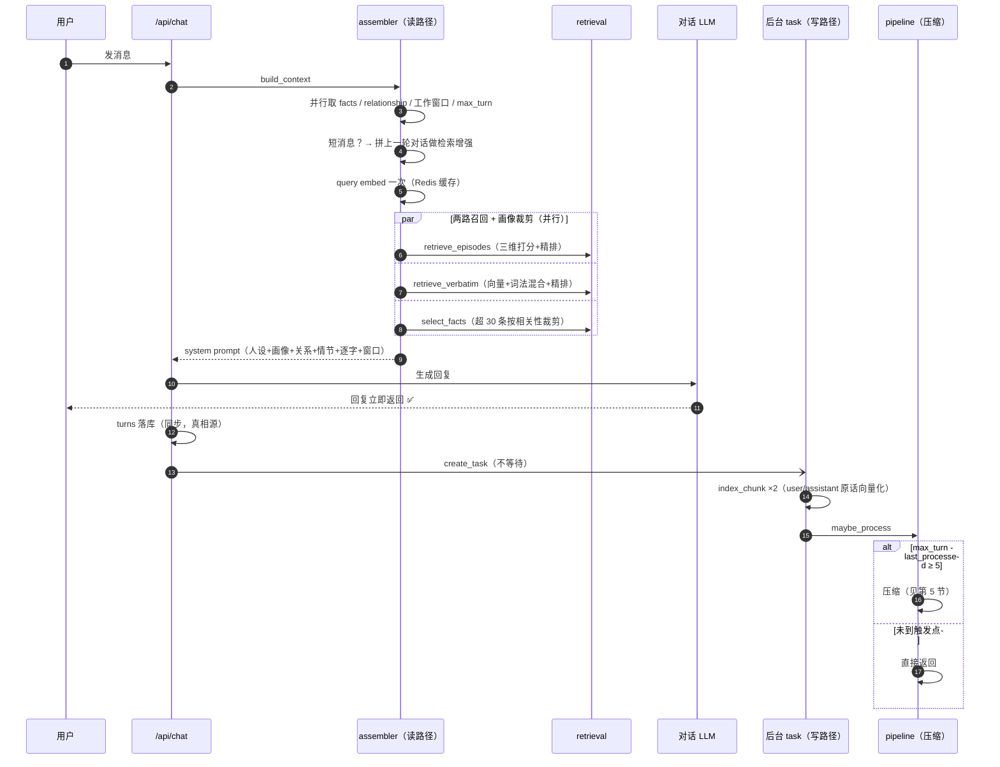
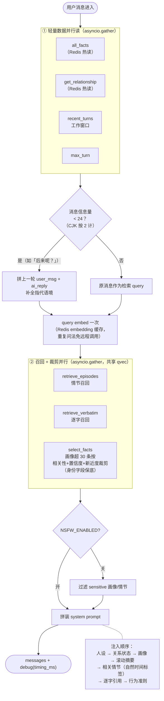
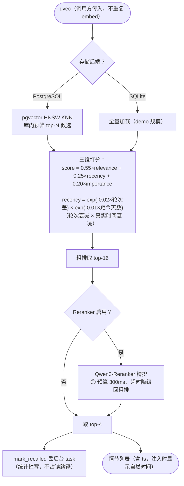
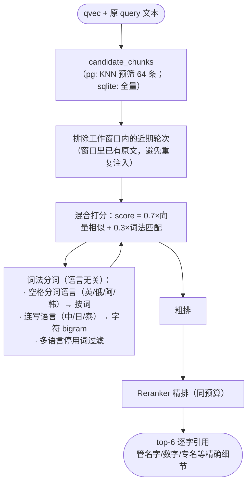
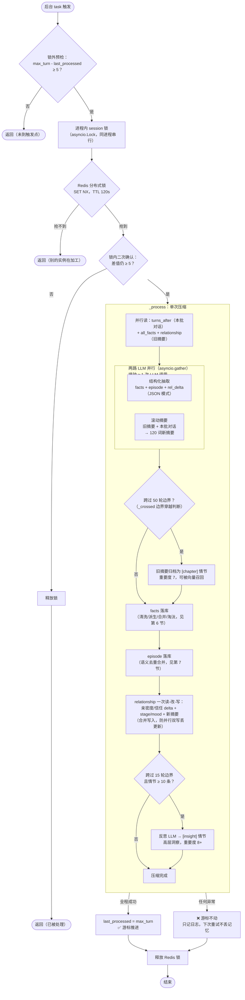
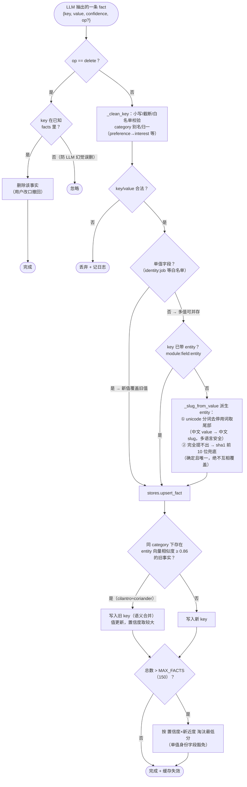
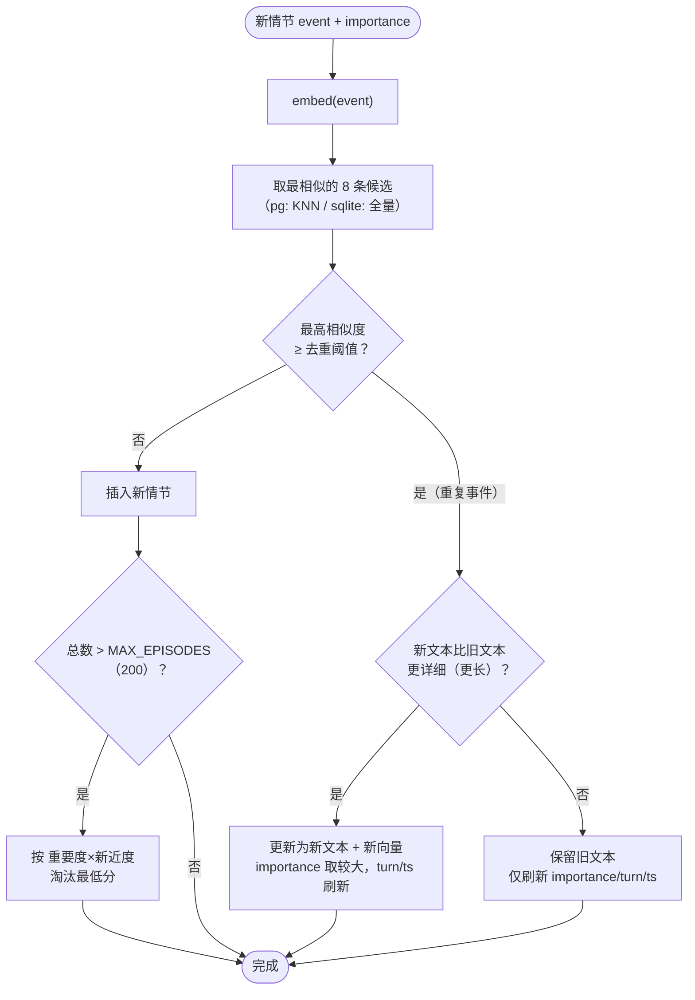
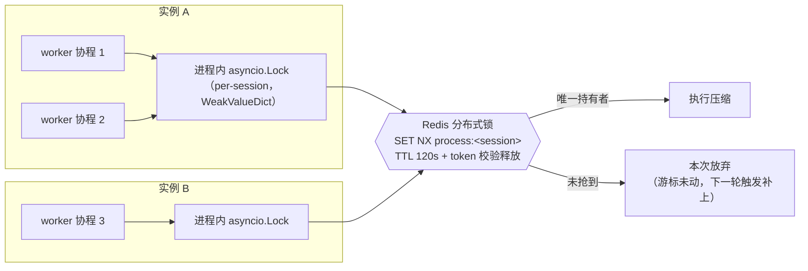

# 流程图全集 —— 记忆系统每条链路的可视化

> 配合 [README](../README.md) 阅读。所有图基于当前代码绘制，与实现一一对应。
>
> - 读路径 = 在线、毫秒级预算，用户每发一条消息走一次
> - 写路径 = 后台异步，永不阻塞对话

---

## 目录

1. [系统总览](#1-系统总览)
2. [一轮对话全链路](#2-一轮对话全链路)
3. [读路径：上下文拼装](#3-读路径上下文拼装)
4. [两路召回细节](#4-两路召回细节)
5. [写路径：记忆压缩管线](#5-写路径记忆压缩管线)
6. [facts 写入：清洗 → 派生 → 合并 → 淘汰](#6-facts-写入清洗--派生--合并--淘汰)
7. [episode 写入：语义去重合并](#7-episode-写入语义去重合并)
8. [并发控制：两级锁](#8-并发控制两级锁)
9. [遗忘与体量治理](#9-遗忘与体量治理)

---

## 1. 系统总览

**分层记忆模型**（每层独立演进，互为补充）：

---

## 2. 一轮对话全链路

---

## 3. 读路径：上下文拼装

`assembler.build_context` —— 毫秒级预算，debug 带分段计时（embed_ms / retrieve_ms / total_ms）。

---

## 4. 两路召回细节

### 4a. 情节召回（retrieve_episodes）

### 4b. 逐字召回（retrieve_verbatim）—— 混合检索

---

## 5. 写路径：记忆压缩管线

`pipeline.maybe_process` → `_process`，整体在后台 task 中异步执行。

---

## 6. facts 写入：清洗 → 派生 → 合并 → 淘汰

每条抽取出的 fact 走这条流水线（`pipeline` 校验 + `stores.upsert_fact`）。

---

## 7. episode 写入：语义去重合并

`stores.add_episode` —— 合并只增不减，不丢信息。

---

## 8. 并发控制：两级锁

多 worker / 多实例部署下，同一 session 的压缩绝不并发执行。

> Redis 未配置时自动退化为仅进程内锁（单实例部署不受影响）；
> 加工失败不推进游标 → 天然的 at-least-once 重试语义。

---

## 9. 遗忘与体量治理

| 对象 | 上限 | 淘汰策略 | 豁免 |
|---|---|---|---|
| facts 画像 | `MAX_FACTS=150` | 置信度 × 轮次新近度，最低分先淘汰 | 单值身份字段（姓名/年龄/职业等） |
| episodes 情节 | `MAX_EPISODES=200` | 重要度 × 新近度，最低分先淘汰 | — |
| chunks 逐字 | `MAX_CHUNKS=500` | 按时间淘汰最旧 | — |
| 滚动摘要 | 120 词 | 每次压缩覆盖重写 | 每 ~50 轮归档为 `[chapter]` 情节 |

**注入端预算**（防止重度用户撑爆 prompt）：

| 注入内容 | 预算 | 超限策略 |
|---|---|---|
| facts | `FACTS_INJECT_TOP_K=30` | 按 query 相关性 + 置信度 + 新近度选 top-K，身份字段保底 |
| episodes | `RETRIEVE_TOP_K=4` | 三维打分 + 精排 |
| verbatim | `RETRIEVE_TOP_K+2=6` | 混合打分 + 精排 |
| 工作窗口 | `WORKING_WINDOW=6` 轮 | 滚动窗口 |
